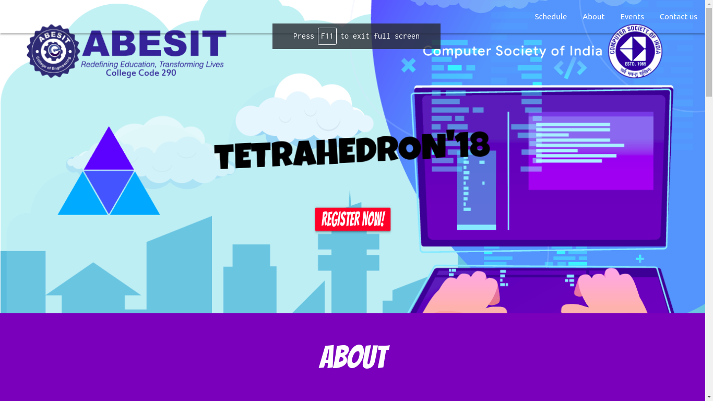

## TETRAHEDRON2K18 :rocket:
 
 Website for event Tetrahedron to showcase the proposed events and registration form to register for the evens.

## Tool and Technologies used:
1. Python 3.7
2. Django
3. SQLite3
4. Heroku Web Hosting
5. HTML
6. MaterializeCSS
7. Adobe Illustrator

## Screenshots 

